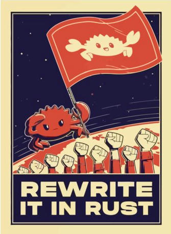

## The Package: Rust edition <a href="https://www.rust-lang.org/"></a>

[](https://github.com/kenf1/thepkg/actions/workflows/cargo_test.yaml)

Collection of KF's commonly-used Rust tools/functions.

### To install:

```{bash}
cargo install --git https://github.com/kenf1/thepkg
```

[thepkg feature flags](./ref/Features.md)

---

> My job: __Rust__,  
> My hobby: __Rust__,  
> My etiology: __Rust__,  
> My profile pic: __REDACTED__  
>
> \- Programmers are also human